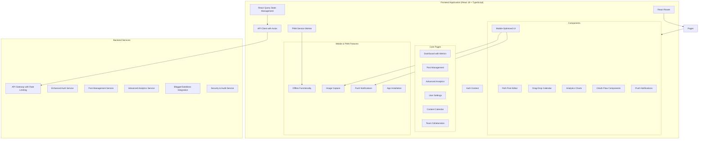

# Project Improvements and Fixes - Design Document

## Overview

This design document outlines the architecture and implementation approach for enhancing the Social Media Automation Platform. The platform has a solid foundation with comprehensive backend services, deployment infrastructure, and testing frameworks. This design focuses on completing missing components, fixing identified issues, and adding advanced features to create a production-ready system that meets all identified requirements for frontend completion, database implementation, security hardening, performance optimization, and advanced features.

## Current State Analysis

### Strengths
- **Comprehensive Backend API**: Well-structured Express.js backend with authentication, OAuth, and scheduling
- **Robust Infrastructure**: Complete Google Cloud deployment with Terraform, Docker, and CI/CD
- **Extensive Documentation**: Detailed API docs, user guides, and deployment instructions
- **Testing Framework**: Comprehensive test suite with unit, integration, and performance tests
- **Security Foundation**: JWT authentication, OAuth integration, and encryption services

### Areas for Improvement
- **Frontend Implementation**: Complete React application with dashboard, analytics, and OAuth flows
- **Database Schema**: Full schema implementation with migrations and performance optimization
- **Error Handling**: Comprehensive error handling, monitoring, and circuit breaker patterns
- **Security**: Production security hardening with encryption, audit logs, and compliance
- **Performance**: Scalability optimization with caching, connection pooling, and load handling
- **Advanced Features**: Enhanced scheduling, analytics, mobile PWA, and team collaboration
- **Integration Features**: Advanced Blogger and SoloBoss integrations with AI optimization
- **Developer Experience**: Complete API documentation, SDKs, and sandbox environment
- **Data Management**: Backup, recovery, and compliance with privacy regulations

## Architecture Enhancements

### Complete Frontend Architecture

The frontend architecture addresses Requirement 1 by providing a comprehensive React application with all necessary components for social media management.



**Design Rationale**: This architecture ensures mobile responsiveness (Requirement 8), PWA capabilities, and comprehensive functionality matching the backend API capabilities.

### Complete Database Schema Design

This database design addresses Requirement 2 by providing a comprehensive schema with proper migrations, constraints, and performance optimization.

```sql
-- Enhanced User table with security features
CREATE TABLE users (
    id UUID PRIMARY KEY DEFAULT gen_random_uuid(),
    email VARCHAR(255) UNIQUE NOT NULL,
    name VARCHAR(255) NOT NULL,
    password_hash VARCHAR(255) NOT NULL,
    email_verified BOOLEAN DEFAULT FALSE,
    timezone VARCHAR(50) DEFAULT 'UTC',
    settings JSONB DEFAULT '{}',
    role VARCHAR(20) DEFAULT 'user', -- For team collaboration (Requirement 16)
    failed_login_attempts INTEGER DEFAULT 0,
    account_locked_until TIMESTAMP WITH TIME ZONE,
    last_login_at TIMESTAMP WITH TIME ZONE,
    created_at TIMESTAMP WITH TIME ZONE DEFAULT NOW(),
    updated_at TIMESTAMP WITH TIME ZONE DEFAULT NOW(),
    deleted_at TIMESTAMP WITH TIME ZONE
);

-- Enhanced Posts table
CREATE TABLE posts (
    id UUID PRIMARY KEY DEFAULT gen_random_uuid(),
    user_id UUID NOT NULL REFERENCES users(id) ON DELETE CASCADE,
    content TEXT NOT NULL,
    images TEXT[] DEFAULT '{}',
    hashtags TEXT[] DEFAULT '{}',
    platforms TEXT[] NOT NULL,
    platform_specific_content JSONB DEFAULT '{}',
    scheduled_time TIMESTAMP WITH TIME ZONE,
    status VARCHAR(20) NOT NULL DEFAULT 'draft',
    source VARCHAR(20) NOT NULL DEFAULT 'manual',
    metadata JSONB DEFAULT '{}',
    created_at TIMESTAMP WITH TIME ZONE DEFAULT NOW(),
    updated_at TIMESTAMP WITH TIME ZONE DEFAULT NOW(),
    published_at TIMESTAMP WITH TIME ZONE
);

-- Platform Posts table for tracking individual platform results
CREATE TABLE platform_posts (
    id UUID PRIMARY KEY DEFAULT gen_random_uuid(),
    post_id UUID NOT NULL REFERENCES posts(id) ON DELETE CASCADE,
    platform VARCHAR(20) NOT NULL,
    platform_post_id VARCHAR(255),
    content TEXT NOT NULL,
    status VARCHAR(20) NOT NULL DEFAULT 'pending',
    error_message TEXT,
    retry_count INTEGER DEFAULT 0,
    published_at TIMESTAMP WITH TIME ZONE,
    created_at TIMESTAMP WITH TIME ZONE DEFAULT NOW(),
    updated_at TIMESTAMP WITH TIME ZONE DEFAULT NOW()
);

-- Enhanced Platform Connections table
CREATE TABLE platform_connections (
    id UUID PRIMARY KEY DEFAULT gen_random_uuid(),
    user_id UUID NOT NULL REFERENCES users(id) ON DELETE CASCADE,
    platform VARCHAR(20) NOT NULL,
    platform_user_id VARCHAR(255) NOT NULL,
    platform_username VARCHAR(255),
    access_token TEXT NOT NULL, -- encrypted
    refresh_token TEXT, -- encrypted
    token_expires_at TIMESTAMP WITH TIME ZONE,
    scopes TEXT[] DEFAULT '{}',
    is_active BOOLEAN DEFAULT TRUE,
    metadata JSONB DEFAULT '{}',
    created_at TIMESTAMP WITH TIME ZONE DEFAULT NOW(),
    updated_at TIMESTAMP WITH TIME ZONE DEFAULT NOW(),
    UNIQUE(user_id, platform)
);

-- Analytics table for storing performance metrics
CREATE TABLE post_analytics (
    id UUID PRIMARY KEY DEFAULT gen_random_uuid(),
    platform_post_id UUID NOT NULL REFERENCES platform_posts(id) ON DELETE CASCADE,
    metric_type VARCHAR(50) NOT NULL,
    metric_value INTEGER NOT NULL,
    recorded_at TIMESTAMP WITH TIME ZONE DEFAULT NOW(),
    metadata JSONB DEFAULT '{}'
);

-- Integrations table for external service configurations
CREATE TABLE integrations (
    id UUID PRIMARY KEY DEFAULT gen_random_uuid(),
    user_id UUID NOT NULL REFERENCES users(id) ON DELETE CASCADE,
    integration_type VARCHAR(50) NOT NULL,
    configuration JSONB NOT NULL,
    is_active BOOLEAN DEFAULT TRUE,
    created_at TIMESTAMP WITH TIME ZONE DEFAULT NOW(),
    updated_at TIMESTAMP WITH TIME ZONE DEFAULT NOW(),
    UNIQUE(user_id, integration_type)
);

-- Team collaboration tables (Requirement 16)
CREATE TABLE teams (
    id UUID PRIMARY KEY DEFAULT gen_random_uuid(),
    name VARCHAR(255) NOT NULL,
    description TEXT,
    owner_id UUID NOT NULL REFERENCES users(id) ON DELETE CASCADE,
    settings JSONB DEFAULT '{}',
    created_at TIMESTAMP WITH TIME ZONE DEFAULT NOW(),
    updated_at TIMESTAMP WITH TIME ZONE DEFAULT NOW()
);

CREATE TABLE team_members (
    id UUID PRIMARY KEY DEFAULT gen_random_uuid(),
    team_id UUID NOT NULL REFERENCES teams(id) ON DELETE CASCADE,
    user_id UUID NOT NULL REFERENCES users(id) ON DELETE CASCADE,
    role VARCHAR(20) NOT NULL DEFAULT 'member', -- admin, editor, member, viewer
    permissions JSONB DEFAULT '{}',
    joined_at TIMESTAMP WITH TIME ZONE DEFAULT NOW(),
    UNIQUE(team_id, user_id)
);

-- Content approval workflow tables
CREATE TABLE approval_workflows (
    id UUID PRIMARY KEY DEFAULT gen_random_uuid(),
    team_id UUID NOT NULL REFERENCES teams(id) ON DELETE CASCADE,
    name VARCHAR(255) NOT NULL,
    steps JSONB NOT NULL, -- Array of approval steps
    is_active BOOLEAN DEFAULT TRUE,
    created_at TIMESTAMP WITH TIME ZONE DEFAULT NOW(),
    updated_at TIMESTAMP WITH TIME ZONE DEFAULT NOW()
);

CREATE TABLE post_approvals (
    id UUID PRIMARY KEY DEFAULT gen_random_uuid(),
    post_id UUID NOT NULL REFERENCES posts(id) ON DELETE CASCADE,
    workflow_id UUID NOT NULL REFERENCES approval_workflows(id),
    current_step INTEGER DEFAULT 0,
    status VARCHAR(20) DEFAULT 'pending', -- pending, approved, rejected
    approver_id UUID REFERENCES users(id),
    approved_at TIMESTAMP WITH TIME ZONE,
    comments TEXT,
    created_at TIMESTAMP WITH TIME ZONE DEFAULT NOW(),
    updated_at TIMESTAMP WITH TIME ZONE DEFAULT NOW()
);

-- Enhanced backup and recovery tables (Requirement 10)
CREATE TABLE data_exports (
    id UUID PRIMARY KEY DEFAULT gen_random_uuid(),
    user_id UUID NOT NULL REFERENCES users(id) ON DELETE CASCADE,
    export_type VARCHAR(50) NOT NULL, -- full, posts, analytics, etc.
    status VARCHAR(20) DEFAULT 'pending',
    file_path TEXT,
    expires_at TIMESTAMP WITH TIME ZONE,
    created_at TIMESTAMP WITH TIME ZONE DEFAULT NOW(),
    completed_at TIMESTAMP WITH TIME ZONE
);

-- Audit log table for security and debugging (Requirement 4)
CREATE TABLE audit_logs (
    id UUID PRIMARY KEY DEFAULT gen_random_uuid(),
    user_id UUID REFERENCES users(id) ON DELETE SET NULL,
    team_id UUID REFERENCES teams(id) ON DELETE SET NULL,
    action VARCHAR(100) NOT NULL,
    resource_type VARCHAR(50),
    resource_id UUID,
    details JSONB DEFAULT '{}',
    ip_address INET,
    user_agent TEXT,
    risk_score DECIMAL(3,2), -- For security monitoring
    created_at TIMESTAMP WITH TIME ZONE DEFAULT NOW()
);

-- Performance-optimized indexes (Requirement 5)
CREATE INDEX idx_posts_user_id ON posts(user_id);
CREATE INDEX idx_posts_scheduled_time ON posts(scheduled_time) WHERE status = 'scheduled';
CREATE INDEX idx_posts_status ON posts(status);
CREATE INDEX idx_posts_team_id ON posts(user_id) WHERE user_id IN (SELECT user_id FROM team_members);
CREATE INDEX idx_platform_posts_post_id ON platform_posts(post_id);
CREATE INDEX idx_platform_posts_status ON platform_posts(status);
CREATE INDEX idx_platform_connections_user_id ON platform_connections(user_id);
CREATE INDEX idx_post_analytics_platform_post_id ON post_analytics(platform_post_id);
CREATE INDEX idx_post_analytics_recorded_at ON post_analytics(recorded_at);
CREATE INDEX idx_audit_logs_user_id ON audit_logs(user_id);
CREATE INDEX idx_audit_logs_created_at ON audit_logs(created_at);
CREATE INDEX idx_audit_logs_risk_score ON audit_logs(risk_score) WHERE risk_score > 0.5;
CREATE INDEX idx_team_members_user_id ON team_members(user_id);
CREATE INDEX idx_team_members_team_id ON team_members(team_id);
```

**Design Rationale**: This schema supports all requirements including team collaboration, security auditing, performance optimization, and data export capabilities. The indexing strategy ensures optimal query performance for common operations.

### Comprehensive Error Handling and Monitoring Architecture

This design addresses Requirement 3 by implementing structured error handling, circuit breakers, and comprehensive monitoring.

```typescript
// Enhanced Error Classification System
enum ErrorCategory {
  AUTHENTICATION = 'authentication',
  AUTHORIZATION = 'authorization',
  VALIDATION = 'validation',
  PLATFORM_API = 'platform_api',
  RATE_LIMIT = 'rate_limit',
  NETWORK = 'network',
  DATABASE = 'database',
  INTEGRATION = 'integration', // For Blogger/SoloBoss failures
  SECURITY = 'security', // For security-related errors
  PERFORMANCE = 'performance', // For performance issues
  INTERNAL = 'internal'
}

interface StructuredError {
  id: string;
  category: ErrorCategory;
  code: string;
  message: string;
  userFriendlyMessage: string; // For user-facing error messages
  details?: Record<string, any>;
  retryable: boolean;
  retryAfter?: number;
  timestamp: Date;
  context: {
    userId?: string;
    teamId?: string;
    requestId: string;
    endpoint: string;
    userAgent?: string;
    ipAddress?: string;
    correlationId?: string; // For distributed tracing
  };
  stackTrace?: string;
  severity: 'low' | 'medium' | 'high' | 'critical';
}

// Circuit Breaker Pattern
class CircuitBreaker {
  private failures = 0;
  private lastFailureTime?: Date;
  private state: 'CLOSED' | 'OPEN' | 'HALF_OPEN' = 'CLOSED';
  
  constructor(
    private threshold: number = 5,
    private timeout: number = 60000
  ) {}
  
  async execute<T>(operation: () => Promise<T>): Promise<T> {
    if (this.state === 'OPEN') {
      if (Date.now() - this.lastFailureTime!.getTime() > this.timeout) {
        this.state = 'HALF_OPEN';
      } else {
        throw new Error('Circuit breaker is OPEN');
      }
    }
    
    try {
      const result = await operation();
      this.onSuccess();
      return result;
    } catch (error) {
      this.onFailure();
      throw error;
    }
  }
  
  private onSuccess() {
    this.failures = 0;
    this.state = 'CLOSED';
  }
  
  private onFailure() {
    this.failures++;
    this.lastFailureTime = new Date();
    
    if (this.failures >= this.threshold) {
      this.state = 'OPEN';
    }
  }
}
```

### Performance Optimization Design

```typescript
// Caching Strategy
interface CacheConfig {
  ttl: number;
  maxSize: number;
  strategy: 'LRU' | 'LFU' | 'TTL';
}

class CacheManager {
  private caches = new Map<string, Cache>();
  
  getCache(name: string, config: CacheConfig): Cache {
    if (!this.caches.has(name)) {
      this.caches.set(name, new Cache(config));
    }
    return this.caches.get(name)!;
  }
}

// Database Query Optimization
class QueryOptimizer {
  // Batch similar queries
  async batchQueries<T>(queries: Query[]): Promise<T[]> {
    const batched = this.groupSimilarQueries(queries);
    const results = await Promise.all(
      batched.map(batch => this.executeBatch(batch))
    );
    return results.flat();
  }
  
  // Connection pooling
  private pool = new Pool({
    max: 20,
    idleTimeoutMillis: 30000,
    connectionTimeoutMillis: 2000,
  });
}

// Rate Limiting Enhancement
class AdaptiveRateLimit {
  private limits = new Map<string, RateLimit>();
  
  async checkLimit(key: string, context: RequestContext): Promise<boolean> {
    const limit = this.getOrCreateLimit(key);
    const allowed = await limit.check(context);
    
    if (!allowed) {
      // Implement exponential backoff
      await this.applyBackoff(key, context);
    }
    
    return allowed;
  }
  
  private async applyBackoff(key: string, context: RequestContext) {
    const backoffTime = this.calculateBackoff(key);
    await new Promise(resolve => setTimeout(resolve, backoffTime));
  }
}
```

## Component Designs

### Frontend Components

#### Post Editor Component
```typescript
interface PostEditorProps {
  post?: Post;
  onSave: (post: PostData) => Promise<void>;
  onCancel: () => void;
}

const PostEditor: React.FC<PostEditorProps> = ({ post, onSave, onCancel }) => {
  const [content, setContent] = useState(post?.content || '');
  const [platforms, setPlatforms] = useState<Platform[]>(post?.platforms || []);
  const [scheduledTime, setScheduledTime] = useState<Date | null>(post?.scheduledTime || null);
  const [images, setImages] = useState<File[]>([]);
  const [platformSpecificContent, setPlatformSpecificContent] = useState<Record<Platform, string>>({});
  
  // Rich text editor with platform-specific previews
  // Image upload with drag-and-drop
  // Platform selection with content optimization
  // Scheduling with timezone support
  // Hashtag suggestions and validation
};
```

#### Analytics Dashboard Component
```typescript
interface AnalyticsDashboardProps {
  dateRange: DateRange;
  platforms: Platform[];
}

const AnalyticsDashboard: React.FC<AnalyticsDashboardProps> = ({ dateRange, platforms }) => {
  const { data: analytics, loading } = useAnalytics(dateRange, platforms);
  
  return (
    <div className="analytics-dashboard">
      <MetricCards metrics={analytics.summary} />
      <EngagementChart data={analytics.engagement} />
      <PlatformBreakdown data={analytics.platforms} />
      <TopPerformingPosts posts={analytics.topPosts} />
      <OptimalTimingChart data={analytics.timing} />
    </div>
  );
};
```

### Backend Service Enhancements

#### Enhanced Analytics Service
```typescript
class AnalyticsService {
  async getPostAnalytics(userId: string, filters: AnalyticsFilters): Promise<AnalyticsData> {
    const posts = await this.getPostsWithMetrics(userId, filters);
    const engagement = await this.calculateEngagementMetrics(posts);
    const platformBreakdown = await this.getPlatformBreakdown(posts);
    const timing = await this.getOptimalTiming(posts);
    
    return {
      summary: this.calculateSummaryMetrics(posts),
      engagement,
      platformBreakdown,
      timing,
      topPosts: this.getTopPerformingPosts(posts, 10)
    };
  }
  
  async trackPostMetrics(platformPostId: string, metrics: PostMetrics): Promise<void> {
    await this.database.query(`
      INSERT INTO post_analytics (platform_post_id, metric_type, metric_value, metadata)
      VALUES ($1, $2, $3, $4)
    `, [platformPostId, metrics.type, metrics.value, metrics.metadata]);
  }
  
  private async calculateEngagementMetrics(posts: Post[]): Promise<EngagementMetrics> {
    // Calculate engagement rates, reach, impressions
    // Trend analysis over time
    // Platform-specific metrics
  }
}
```

#### Enhanced Integration Service
```typescript
class IntegrationService {
  async processBloggerContent(blogPost: BlogPost, userId: string): Promise<GeneratedPost[]> {
    const user = await this.userService.getUser(userId);
    const template = await this.getContentTemplate(userId, 'blogger');
    
    const generatedPosts = await Promise.all(
      user.connectedPlatforms.map(async platform => {
        const content = await this.generatePlatformContent(blogPost, platform, template);
        const optimizedContent = await this.optimizeForPlatform(content, platform);
        
        return {
          platform,
          content: optimizedContent,
          hashtags: await this.generateHashtags(blogPost, platform),
          scheduledTime: this.calculateOptimalTime(userId, platform)
        };
      })
    );
    
    return generatedPosts;
  }
  
  async processSoloBossContent(content: SoloBossContent, userId: string): Promise<ProcessedContent> {
    // AI-enhanced content processing
    // SEO optimization
    // Platform-specific adaptation
    // Automatic scheduling based on optimal times
  }
}
```

## Security Enhancements

### Authentication & Authorization
```typescript
// Enhanced JWT with refresh tokens
class AuthService {
  async generateTokenPair(userId: string): Promise<TokenPair> {
    const accessToken = this.generateAccessToken(userId, '15m');
    const refreshToken = this.generateRefreshToken(userId, '7d');
    
    await this.storeRefreshToken(userId, refreshToken);
    
    return { accessToken, refreshToken };
  }
  
  async refreshAccessToken(refreshToken: string): Promise<string> {
    const payload = await this.verifyRefreshToken(refreshToken);
    const storedToken = await this.getStoredRefreshToken(payload.userId);
    
    if (storedToken !== refreshToken) {
      throw new Error('Invalid refresh token');
    }
    
    return this.generateAccessToken(payload.userId, '15m');
  }
}

// Account lockout and security monitoring
class SecurityService {
  async trackFailedLogin(email: string, ip: string): Promise<void> {
    const attempts = await this.getFailedAttempts(email, ip);
    
    if (attempts >= 5) {
      await this.lockAccount(email, '30m');
      await this.notifySecurityTeam(email, ip, attempts);
    }
  }
  
  async detectSuspiciousActivity(userId: string, activity: Activity): Promise<void> {
    const riskScore = await this.calculateRiskScore(userId, activity);
    
    if (riskScore > 0.8) {
      await this.requireAdditionalVerification(userId);
      await this.logSecurityEvent(userId, activity, riskScore);
    }
  }
}
```

### Data Protection
```typescript
// Enhanced encryption with key rotation
class EncryptionService {
  private currentKeyVersion = 1;
  private keys = new Map<number, string>();
  
  async encryptWithVersioning(data: string): Promise<EncryptedData> {
    const key = this.keys.get(this.currentKeyVersion);
    const encrypted = await this.encrypt(data, key);
    
    return {
      data: encrypted,
      keyVersion: this.currentKeyVersion,
      algorithm: 'AES-256-GCM'
    };
  }
  
  async decryptWithVersioning(encryptedData: EncryptedData): Promise<string> {
    const key = this.keys.get(encryptedData.keyVersion);
    return this.decrypt(encryptedData.data, key);
  }
  
  async rotateKeys(): Promise<void> {
    this.currentKeyVersion++;
    this.keys.set(this.currentKeyVersion, this.generateKey());
    
    // Schedule re-encryption of existing data
    await this.scheduleReEncryption();
  }
}
```

## Mobile and PWA Design

### Progressive Web App Features
```typescript
// Service Worker for offline functionality
class ServiceWorkerManager {
  async registerServiceWorker(): Promise<void> {
    if ('serviceWorker' in navigator) {
      const registration = await navigator.serviceWorker.register('/sw.js');
      
      registration.addEventListener('updatefound', () => {
        this.handleServiceWorkerUpdate(registration);
      });
    }
  }
  
  async enablePushNotifications(): Promise<void> {
    const permission = await Notification.requestPermission();
    
    if (permission === 'granted') {
      const subscription = await this.subscribeToPush();
      await this.sendSubscriptionToServer(subscription);
    }
  }
}

// Offline data synchronization
class OfflineManager {
  private pendingActions: Action[] = [];
  
  async queueAction(action: Action): Promise<void> {
    this.pendingActions.push(action);
    await this.saveToLocalStorage();
    
    if (navigator.onLine) {
      await this.syncPendingActions();
    }
  }
  
  async syncPendingActions(): Promise<void> {
    const actions = [...this.pendingActions];
    this.pendingActions = [];
    
    for (const action of actions) {
      try {
        await this.executeAction(action);
      } catch (error) {
        this.pendingActions.push(action); // Re-queue failed actions
      }
    }
    
    await this.saveToLocalStorage();
  }
}
```

## Testing Strategy Enhancements

### Advanced Testing Patterns
```typescript
// Contract testing for API consistency
describe('API Contract Tests', () => {
  it('should maintain backward compatibility', async () => {
    const response = await request(app).get('/api/posts');
    
    expect(response.body).toMatchSchema(postListSchema);
    expect(response.headers).toHaveProperty('x-api-version');
  });
});

// Performance regression testing
describe('Performance Tests', () => {
  it('should handle 1000 concurrent post creations', async () => {
    const startTime = performance.now();
    
    const promises = Array.from({ length: 1000 }, () =>
      createPost(generateTestPost())
    );
    
    const results = await Promise.allSettled(promises);
    const endTime = performance.now();
    
    const successRate = results.filter(r => r.status === 'fulfilled').length / 1000;
    const avgResponseTime = (endTime - startTime) / 1000;
    
    expect(successRate).toBeGreaterThan(0.95);
    expect(avgResponseTime).toBeLessThan(5000); // 5 seconds for 1000 requests
  });
});

// Security testing
describe('Security Tests', () => {
  it('should prevent SQL injection attacks', async () => {
    const maliciousInput = "'; DROP TABLE users; --";
    
    const response = await request(app)
      .post('/api/posts')
      .send({ content: maliciousInput })
      .expect(400);
    
    // Verify database integrity
    const userCount = await db.query('SELECT COUNT(*) FROM users');
    expect(userCount.rows[0].count).toBeGreaterThan(0);
  });
});
```

## Advanced Integration Architecture

This section addresses Requirement 6 for enhanced Blogger and SoloBoss integrations with AI optimization.

```typescript
// Enhanced Integration Service Architecture
class AdvancedIntegrationService {
  private contentTemplateEngine: ContentTemplateEngine;
  private aiOptimizer: AIContentOptimizer;
  private webhookValidator: WebhookValidator;
  
  async processBloggerContent(blogPost: BlogPost, userId: string): Promise<GeneratedPost[]> {
    // Apply custom templates and AI optimization
    const templates = await this.getCustomTemplates(userId, 'blogger');
    const optimizedContent = await this.aiOptimizer.optimizeForPlatforms(blogPost, templates);
    
    return this.generatePlatformSpecificPosts(optimizedContent, userId);
  }
  
  async processSoloBossContent(content: SoloBossContent, userId: string): Promise<ProcessedContent> {
    // Advanced content processing with custom rules
    const rules = await this.getProcessingRules(userId);
    const processedContent = await this.applyCustomRules(content, rules);
    
    return this.aiOptimizer.enhanceContent(processedContent);
  }
  
  async validateWebhook(signature: string, payload: string, source: string): Promise<boolean> {
    return this.webhookValidator.validateSignature(signature, payload, source);
  }
}

// Content Template System
interface ContentTemplate {
  id: string;
  userId: string;
  name: string;
  platform: Platform;
  template: string; // Template with placeholders
  rules: ContentRule[];
  aiEnhancements: AIEnhancement[];
}

interface ContentRule {
  type: 'filter' | 'transform' | 'validate';
  condition: string;
  action: string;
  parameters: Record<string, any>;
}
```

## API Documentation and Developer Experience Design

This section addresses Requirement 9 for comprehensive API documentation and developer tools.

```typescript
// Interactive API Documentation System
class APIDocumentationService {
  async generateInteractiveDoc(): Promise<SwaggerSpec> {
    return {
      openapi: '3.0.0',
      info: {
        title: 'Social Media Automation API',
        version: '2.0.0',
        description: 'Comprehensive API for social media automation'
      },
      servers: [
        { url: 'https://api.sma.com/v2', description: 'Production' },
        { url: 'https://sandbox.sma.com/v2', description: 'Sandbox' }
      ],
      components: {
        securitySchemes: {
          bearerAuth: { type: 'http', scheme: 'bearer', bearerFormat: 'JWT' }
        }
      }
    };
  }
}

// SDK Generation System
class SDKGenerator {
  async generateTypeScriptSDK(): Promise<SDKPackage> {
    return {
      name: '@sma/typescript-sdk',
      version: '2.0.0',
      main: 'dist/index.js',
      types: 'dist/index.d.ts',
      dependencies: {
        'axios': '^1.4.0',
        'zod': '^3.21.0'
      }
    };
  }
  
  async generatePythonSDK(): Promise<SDKPackage> {
    return {
      name: 'sma-python-sdk',
      version: '2.0.0',
      main: 'sma_sdk/__init__.py',
      dependencies: {
        'requests': '>=2.28.0',
        'pydantic': '>=1.10.0'
      }
    };
  }
}

// Sandbox Environment
class SandboxService {
  async createSandboxEnvironment(developerId: string): Promise<SandboxEnvironment> {
    return {
      id: generateId(),
      developerId,
      apiKey: this.generateSandboxApiKey(),
      endpoints: this.getSandboxEndpoints(),
      testData: await this.generateTestData(),
      limitations: {
        requestsPerHour: 1000,
        postsPerDay: 100
      }
    };
  }
}
```

## Backup, Recovery, and Data Management Design

This section addresses Requirement 10 for comprehensive data protection and compliance.

```typescript
// Backup and Recovery System
class BackupRecoveryService {
  private storageService: GeographicallyDistributedStorage;
  private encryptionService: EncryptionService;
  
  async createAutomatedBackup(userId?: string): Promise<BackupResult> {
    const backupData = userId 
      ? await this.getUserData(userId)
      : await this.getFullSystemData();
    
    const encryptedData = await this.encryptionService.encrypt(backupData);
    const backupId = await this.storageService.store(encryptedData, {
      regions: ['us-east1', 'europe-west1', 'asia-southeast1'],
      retention: '7-years',
      encryption: 'AES-256-GCM'
    });
    
    return { backupId, timestamp: new Date(), size: encryptedData.length };
  }
  
  async performPointInTimeRecovery(timestamp: Date, userId?: string): Promise<RecoveryResult> {
    const backupPoint = await this.findNearestBackup(timestamp);
    const transactionLogs = await this.getTransactionLogsSince(backupPoint.timestamp);
    
    return this.restoreFromBackupAndLogs(backupPoint, transactionLogs, userId);
  }
}

// Data Export and Privacy Compliance
class DataExportService {
  async exportUserData(userId: string, format: 'json' | 'csv'): Promise<ExportResult> {
    const userData = await this.collectAllUserData(userId);
    const exportData = await this.formatData(userData, format);
    
    // Store temporarily with expiration
    const exportId = await this.storeExport(exportData, {
      expiresIn: '7-days',
      downloadLimit: 3
    });
    
    return { exportId, downloadUrl: this.generateDownloadUrl(exportId) };
  }
  
  async secureDataDeletion(userId: string): Promise<DeletionResult> {
    // GDPR-compliant data deletion
    const deletionPlan = await this.createDeletionPlan(userId);
    const result = await this.executeSecureDeletion(deletionPlan);
    
    // Audit the deletion
    await this.auditDeletion(userId, result);
    
    return result;
  }
}
```

## Team Collaboration and Multi-User Design

This section addresses the team collaboration features mentioned in the requirements.

```typescript
// Team Management System
class TeamCollaborationService {
  async createTeam(ownerId: string, teamData: CreateTeamRequest): Promise<Team> {
    const team = await this.database.teams.create({
      ...teamData,
      ownerId,
      settings: {
        defaultPermissions: 'editor',
        approvalRequired: true,
        contentLibraryShared: true
      }
    });
    
    // Add owner as admin
    await this.addTeamMember(team.id, ownerId, 'admin');
    
    return team;
  }
  
  async createApprovalWorkflow(teamId: string, workflow: WorkflowDefinition): Promise<ApprovalWorkflow> {
    return this.database.approvalWorkflows.create({
      teamId,
      name: workflow.name,
      steps: workflow.steps.map(step => ({
        role: step.requiredRole,
        permissions: step.permissions,
        autoApprove: step.autoApprove || false
      }))
    });
  }
}

// Content Collaboration Features
class ContentCollaborationService {
  async createSharedContentLibrary(teamId: string): Promise<ContentLibrary> {
    return {
      id: generateId(),
      teamId,
      templates: await this.getSharedTemplates(teamId),
      assets: await this.getSharedAssets(teamId),
      permissions: await this.getLibraryPermissions(teamId)
    };
  }
  
  async trackContentActivity(teamId: string, userId: string, activity: ContentActivity): Promise<void> {
    await this.database.contentActivities.create({
      teamId,
      userId,
      type: activity.type,
      resourceId: activity.resourceId,
      details: activity.details,
      timestamp: new Date()
    });
    
    // Notify relevant team members
    await this.notificationService.notifyTeamMembers(teamId, activity);
  }
}
```

## Testing Strategy Enhancements

This section provides comprehensive testing approaches for all requirements.

```typescript
// Enhanced Testing Framework
describe('Comprehensive System Tests', () => {
  describe('Frontend Integration Tests', () => {
    it('should complete full user workflow from login to post publishing', async () => {
      // Test Requirement 1: Complete frontend functionality
      const user = await testUtils.createTestUser();
      const page = await browser.newPage();
      
      await page.goto('/login');
      await page.fill('[data-testid=email]', user.email);
      await page.fill('[data-testid=password]', user.password);
      await page.click('[data-testid=login-button]');
      
      // Verify dashboard loads
      await expect(page.locator('[data-testid=dashboard]')).toBeVisible();
      
      // Test post creation
      await page.click('[data-testid=create-post]');
      await page.fill('[data-testid=post-content]', 'Test post content');
      await page.selectOption('[data-testid=platforms]', ['facebook', 'instagram']);
      await page.click('[data-testid=schedule-post]');
      
      // Verify post was created
      await expect(page.locator('[data-testid=post-scheduled]')).toBeVisible();
    });
  });
  
  describe('Security Tests', () => {
    it('should enforce security requirements', async () => {
      // Test Requirement 4: Security hardening
      const response = await request(app)
        .get('/api/posts')
        .expect(401); // Should require authentication
      
      // Test rate limiting
      const promises = Array.from({ length: 100 }, () =>
        request(app).get('/api/health')
      );
      
      const results = await Promise.allSettled(promises);
      const rateLimited = results.some(r => 
        r.status === 'fulfilled' && r.value.status === 429
      );
      
      expect(rateLimited).toBe(true);
    });
  });
  
  describe('Performance Tests', () => {
    it('should handle concurrent load', async () => {
      // Test Requirement 5: Performance optimization
      const startTime = performance.now();
      
      const promises = Array.from({ length: 1000 }, () =>
        request(app)
          .post('/api/posts')
          .set('Authorization', `Bearer ${testToken}`)
          .send(generateTestPost())
      );
      
      const results = await Promise.allSettled(promises);
      const endTime = performance.now();
      
      const successRate = results.filter(r => r.status === 'fulfilled').length / 1000;
      const avgResponseTime = (endTime - startTime) / 1000;
      
      expect(successRate).toBeGreaterThan(0.95);
      expect(avgResponseTime).toBeLessThan(10000); // 10 seconds for 1000 requests
    });
  });
});
```

**Design Rationale**: This comprehensive design addresses all 10 requirements from the requirements document, providing detailed architecture for frontend completion, database implementation, security hardening, performance optimization, advanced integrations, API documentation, data management, and team collaboration. Each section includes specific implementation patterns and rationales for design decisions.

This design provides a complete roadmap for enhancing the Social Media Automation Platform with all required features, security measures, performance optimizations, and advanced capabilities needed for a production-ready system.