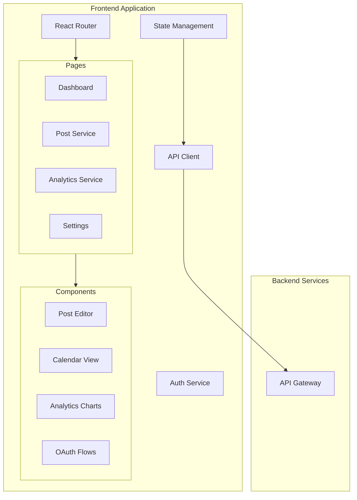

# Project Improvements and Fixes - Design Document

## Overview

This design document outlines the architecture and implementation approach for enhancing the Social Media Automation Platform. The platform has a solid foundation with comprehensive backend services, deployment infrastructure, and testing frameworks. This design focuses on completing missing components, fixing identified issues, and adding advanced features to create a production-ready system.

## Current State Analysis

### Strengths
- **Comprehensive Backend API**: Well-structured Express.js backend with authentication, OAuth, and scheduling
- **Robust Infrastructure**: Complete Google Cloud deployment with Terraform, Docker, and CI/CD
- **Extensive Documentation**: Detailed API docs, user guides, and deployment instructions
- **Testing Framework**: Comprehensive test suite with unit, integration, and performance tests
- **Security Foundation**: JWT authentication, OAuth integration, and encryption services

### Areas for Improvement
- **Frontend Implementation**: Basic React structure needs completion
- **Database Schema**: Missing complete schema implementation and migrations
- **Error Handling**: Need enhanced error handling and monitoring
- **Performance**: Optimization needed for production scale
- **Advanced Features**: Missing advanced scheduling, analytics, and mobile support

## Architecture Enhancements

### Frontend Architecture



### Database Schema Design

```sql
-- Enhanced User table
CREATE TABLE users (
    id UUID PRIMARY KEY DEFAULT gen_random_uuid(),
    email VARCHAR(255) UNIQUE NOT NULL,
    name VARCHAR(255) NOT NULL,
    password_hash VARCHAR(255) NOT NULL,
    email_verified BOOLEAN DEFAULT FALSE,
    timezone VARCHAR(50) DEFAULT 'UTC',
    settings JSONB DEFAULT '{}',
    created_at TIMESTAMP WITH TIME ZONE DEFAULT NOW(),
    updated_at TIMESTAMP WITH TIME ZONE DEFAULT NOW(),
    deleted_at TIMESTAMP WITH TIME ZONE
);

-- Enhanced Posts table
CREATE TABLE posts (
    id UUID PRIMARY KEY DEFAULT gen_random_uuid(),
    user_id UUID NOT NULL REFERENCES users(id) ON DELETE CASCADE,
    content TEXT NOT NULL,
    images TEXT[] DEFAULT '{}',
    hashtags TEXT[] DEFAULT '{}',
    platforms TEXT[] NOT NULL,
    platform_specific_content JSONB DEFAULT '{}',
    scheduled_time TIMESTAMP WITH TIME ZONE,
    status VARCHAR(20) NOT NULL DEFAULT 'draft',
    source VARCHAR(20) NOT NULL DEFAULT 'manual',
    metadata JSONB DEFAULT '{}',
    created_at TIMESTAMP WITH TIME ZONE DEFAULT NOW(),
    updated_at TIMESTAMP WITH TIME ZONE DEFAULT NOW(),
    published_at TIMESTAMP WITH TIME ZONE
);

-- Platform Posts table for tracking individual platform results
CREATE TABLE platform_posts (
    id UUID PRIMARY KEY DEFAULT gen_random_uuid(),
    post_id UUID NOT NULL REFERENCES posts(id) ON DELETE CASCADE,
    platform VARCHAR(20) NOT NULL,
    platform_post_id VARCHAR(255),
    content TEXT NOT NULL,
    status VARCHAR(20) NOT NULL DEFAULT 'pending',
    error_message TEXT,
    retry_count INTEGER DEFAULT 0,
    published_at TIMESTAMP WITH TIME ZONE,
    created_at TIMESTAMP WITH TIME ZONE DEFAULT NOW(),
    updated_at TIMESTAMP WITH TIME ZONE DEFAULT NOW()
);

-- Enhanced Platform Connections table
CREATE TABLE platform_connections (
    id UUID PRIMARY KEY DEFAULT gen_random_uuid(),
    user_id UUID NOT NULL REFERENCES users(id) ON DELETE CASCADE,
    platform VARCHAR(20) NOT NULL,
    platform_user_id VARCHAR(255) NOT NULL,
    platform_username VARCHAR(255),
    access_token TEXT NOT NULL, -- encrypted
    refresh_token TEXT, -- encrypted
    token_expires_at TIMESTAMP WITH TIME ZONE,
    scopes TEXT[] DEFAULT '{}',
    is_active BOOLEAN DEFAULT TRUE,
    metadata JSONB DEFAULT '{}',
    created_at TIMESTAMP WITH TIME ZONE DEFAULT NOW(),
    updated_at TIMESTAMP WITH TIME ZONE DEFAULT NOW(),
    UNIQUE(user_id, platform)
);

-- Analytics table for storing performance metrics
CREATE TABLE post_analytics (
    id UUID PRIMARY KEY DEFAULT gen_random_uuid(),
    platform_post_id UUID NOT NULL REFERENCES platform_posts(id) ON DELETE CASCADE,
    metric_type VARCHAR(50) NOT NULL,
    metric_value INTEGER NOT NULL,
    recorded_at TIMESTAMP WITH TIME ZONE DEFAULT NOW(),
    metadata JSONB DEFAULT '{}'
);

-- Integrations table for external service configurations
CREATE TABLE integrations (
    id UUID PRIMARY KEY DEFAULT gen_random_uuid(),
    user_id UUID NOT NULL REFERENCES users(id) ON DELETE CASCADE,
    integration_type VARCHAR(50) NOT NULL,
    configuration JSONB NOT NULL,
    is_active BOOLEAN DEFAULT TRUE,
    created_at TIMESTAMP WITH TIME ZONE DEFAULT NOW(),
    updated_at TIMESTAMP WITH TIME ZONE DEFAULT NOW(),
    UNIQUE(user_id, integration_type)
);

-- Audit log table for security and debugging
CREATE TABLE audit_logs (
    id UUID PRIMARY KEY DEFAULT gen_random_uuid(),
    user_id UUID REFERENCES users(id) ON DELETE SET NULL,
    action VARCHAR(100) NOT NULL,
    resource_type VARCHAR(50),
    resource_id UUID,
    details JSONB DEFAULT '{}',
    ip_address INET,
    user_agent TEXT,
    created_at TIMESTAMP WITH TIME ZONE DEFAULT NOW()
);

-- Indexes for performance
CREATE INDEX idx_posts_user_id ON posts(user_id);
CREATE INDEX idx_posts_scheduled_time ON posts(scheduled_time) WHERE status = 'scheduled';
CREATE INDEX idx_posts_status ON posts(status);
CREATE INDEX idx_platform_posts_post_id ON platform_posts(post_id);
CREATE INDEX idx_platform_posts_status ON platform_posts(status);
CREATE INDEX idx_platform_connections_user_id ON platform_connections(user_id);
CREATE INDEX idx_post_analytics_platform_post_id ON post_analytics(platform_post_id);
CREATE INDEX idx_audit_logs_user_id ON audit_logs(user_id);
CREATE INDEX idx_audit_logs_created_at ON audit_logs(created_at);
```

### Enhanced Error Handling Architecture

```typescript
// Error Classification System
enum ErrorCategory {
  AUTHENTICATION = 'authentication',
  AUTHORIZATION = 'authorization',
  VALIDATION = 'validation',
  PLATFORM_API = 'platform_api',
  RATE_LIMIT = 'rate_limit',
  NETWORK = 'network',
  DATABASE = 'database',
  INTERNAL = 'internal'
}

interface StructuredError {
  id: string;
  category: ErrorCategory;
  code: string;
  message: string;
  details?: Record<string, any>;
  retryable: boolean;
  retryAfter?: number;
  timestamp: Date;
  context: {
    userId?: string;
    requestId: string;
    endpoint: string;
    userAgent?: string;
  };
}

// Circuit Breaker Pattern
class CircuitBreaker {
  private failures = 0;
  private lastFailureTime?: Date;
  private state: 'CLOSED' | 'OPEN' | 'HALF_OPEN' = 'CLOSED';
  
  constructor(
    private threshold: number = 5,
    private timeout: number = 60000
  ) {}
  
  async execute<T>(operation: () => Promise<T>): Promise<T> {
    if (this.state === 'OPEN') {
      if (Date.now() - this.lastFailureTime!.getTime() > this.timeout) {
        this.state = 'HALF_OPEN';
      } else {
        throw new Error('Circuit breaker is OPEN');
      }
    }
    
    try {
      const result = await operation();
      this.onSuccess();
      return result;
    } catch (error) {
      this.onFailure();
      throw error;
    }
  }
  
  private onSuccess() {
    this.failures = 0;
    this.state = 'CLOSED';
  }
  
  private onFailure() {
    this.failures++;
    this.lastFailureTime = new Date();
    
    if (this.failures >= this.threshold) {
      this.state = 'OPEN';
    }
  }
}
```

### Performance Optimization Design

```typescript
// Caching Strategy
interface CacheConfig {
  ttl: number;
  maxSize: number;
  strategy: 'LRU' | 'LFU' | 'TTL';
}

class CacheManager {
  private caches = new Map<string, Cache>();
  
  getCache(name: string, config: CacheConfig): Cache {
    if (!this.caches.has(name)) {
      this.caches.set(name, new Cache(config));
    }
    return this.caches.get(name)!;
  }
}

// Database Query Optimization
class QueryOptimizer {
  // Batch similar queries
  async batchQueries<T>(queries: Query[]): Promise<T[]> {
    const batched = this.groupSimilarQueries(queries);
    const results = await Promise.all(
      batched.map(batch => this.executeBatch(batch))
    );
    return results.flat();
  }
  
  // Connection pooling
  private pool = new Pool({
    max: 20,
    idleTimeoutMillis: 30000,
    connectionTimeoutMillis: 2000,
  });
}

// Rate Limiting Enhancement
class AdaptiveRateLimit {
  private limits = new Map<string, RateLimit>();
  
  async checkLimit(key: string, context: RequestContext): Promise<boolean> {
    const limit = this.getOrCreateLimit(key);
    const allowed = await limit.check(context);
    
    if (!allowed) {
      // Implement exponential backoff
      await this.applyBackoff(key, context);
    }
    
    return allowed;
  }
  
  private async applyBackoff(key: string, context: RequestContext) {
    const backoffTime = this.calculateBackoff(key);
    await new Promise(resolve => setTimeout(resolve, backoffTime));
  }
}
```

## Component Designs

### Frontend Components

#### Post Editor Component
```typescript
interface PostEditorProps {
  post?: Post;
  onSave: (post: PostData) => Promise<void>;
  onCancel: () => void;
}

const PostEditor: React.FC<PostEditorProps> = ({ post, onSave, onCancel }) => {
  const [content, setContent] = useState(post?.content || '');
  const [platforms, setPlatforms] = useState<Platform[]>(post?.platforms || []);
  const [scheduledTime, setScheduledTime] = useState<Date | null>(post?.scheduledTime || null);
  const [images, setImages] = useState<File[]>([]);
  const [platformSpecificContent, setPlatformSpecificContent] = useState<Record<Platform, string>>({});
  
  // Rich text editor with platform-specific previews
  // Image upload with drag-and-drop
  // Platform selection with content optimization
  // Scheduling with timezone support
  // Hashtag suggestions and validation
};
```

#### Analytics Dashboard Component
```typescript
interface AnalyticsDashboardProps {
  dateRange: DateRange;
  platforms: Platform[];
}

const AnalyticsDashboard: React.FC<AnalyticsDashboardProps> = ({ dateRange, platforms }) => {
  const { data: analytics, loading } = useAnalytics(dateRange, platforms);
  
  return (
    <div className="analytics-dashboard">
      <MetricCards metrics={analytics.summary} />
      <EngagementChart data={analytics.engagement} />
      <PlatformBreakdown data={analytics.platforms} />
      <TopPerformingPosts posts={analytics.topPosts} />
      <OptimalTimingChart data={analytics.timing} />
    </div>
  );
};
```

### Backend Service Enhancements

#### Enhanced Analytics Service
```typescript
class AnalyticsService {
  async getPostAnalytics(userId: string, filters: AnalyticsFilters): Promise<AnalyticsData> {
    const posts = await this.getPostsWithMetrics(userId, filters);
    const engagement = await this.calculateEngagementMetrics(posts);
    const platformBreakdown = await this.getPlatformBreakdown(posts);
    const timing = await this.getOptimalTiming(posts);
    
    return {
      summary: this.calculateSummaryMetrics(posts),
      engagement,
      platformBreakdown,
      timing,
      topPosts: this.getTopPerformingPosts(posts, 10)
    };
  }
  
  async trackPostMetrics(platformPostId: string, metrics: PostMetrics): Promise<void> {
    await this.database.query(`
      INSERT INTO post_analytics (platform_post_id, metric_type, metric_value, metadata)
      VALUES ($1, $2, $3, $4)
    `, [platformPostId, metrics.type, metrics.value, metrics.metadata]);
  }
  
  private async calculateEngagementMetrics(posts: Post[]): Promise<EngagementMetrics> {
    // Calculate engagement rates, reach, impressions
    // Trend analysis over time
    // Platform-specific metrics
  }
}
```

#### Enhanced Integration Service
```typescript
class IntegrationService {
  async processBloggerContent(blogPost: BlogPost, userId: string): Promise<GeneratedPost[]> {
    const user = await this.userService.getUser(userId);
    const template = await this.getContentTemplate(userId, 'blogger');
    
    const generatedPosts = await Promise.all(
      user.connectedPlatforms.map(async platform => {
        const content = await this.generatePlatformContent(blogPost, platform, template);
        const optimizedContent = await this.optimizeForPlatform(content, platform);
        
        return {
          platform,
          content: optimizedContent,
          hashtags: await this.generateHashtags(blogPost, platform),
          scheduledTime: this.calculateOptimalTime(userId, platform)
        };
      })
    );
    
    return generatedPosts;
  }
  
  async processSoloBossContent(content: SoloBossContent, userId: string): Promise<ProcessedContent> {
    // AI-enhanced content processing
    // SEO optimization
    // Platform-specific adaptation
    // Automatic scheduling based on optimal times
  }
}
```

## Security Enhancements

### Authentication & Authorization
```typescript
// Enhanced JWT with refresh tokens
class AuthService {
  async generateTokenPair(userId: string): Promise<TokenPair> {
    const accessToken = this.generateAccessToken(userId, '15m');
    const refreshToken = this.generateRefreshToken(userId, '7d');
    
    await this.storeRefreshToken(userId, refreshToken);
    
    return { accessToken, refreshToken };
  }
  
  async refreshAccessToken(refreshToken: string): Promise<string> {
    const payload = await this.verifyRefreshToken(refreshToken);
    const storedToken = await this.getStoredRefreshToken(payload.userId);
    
    if (storedToken !== refreshToken) {
      throw new Error('Invalid refresh token');
    }
    
    return this.generateAccessToken(payload.userId, '15m');
  }
}

// Account lockout and security monitoring
class SecurityService {
  async trackFailedLogin(email: string, ip: string): Promise<void> {
    const attempts = await this.getFailedAttempts(email, ip);
    
    if (attempts >= 5) {
      await this.lockAccount(email, '30m');
      await this.notifySecurityTeam(email, ip, attempts);
    }
  }
  
  async detectSuspiciousActivity(userId: string, activity: Activity): Promise<void> {
    const riskScore = await this.calculateRiskScore(userId, activity);
    
    if (riskScore > 0.8) {
      await this.requireAdditionalVerification(userId);
      await this.logSecurityEvent(userId, activity, riskScore);
    }
  }
}
```

### Data Protection
```typescript
// Enhanced encryption with key rotation
class EncryptionService {
  private currentKeyVersion = 1;
  private keys = new Map<number, string>();
  
  async encryptWithVersioning(data: string): Promise<EncryptedData> {
    const key = this.keys.get(this.currentKeyVersion);
    const encrypted = await this.encrypt(data, key);
    
    return {
      data: encrypted,
      keyVersion: this.currentKeyVersion,
      algorithm: 'AES-256-GCM'
    };
  }
  
  async decryptWithVersioning(encryptedData: EncryptedData): Promise<string> {
    const key = this.keys.get(encryptedData.keyVersion);
    return this.decrypt(encryptedData.data, key);
  }
  
  async rotateKeys(): Promise<void> {
    this.currentKeyVersion++;
    this.keys.set(this.currentKeyVersion, this.generateKey());
    
    // Schedule re-encryption of existing data
    await this.scheduleReEncryption();
  }
}
```

## Mobile and PWA Design

### Progressive Web App Features
```typescript
// Service Worker for offline functionality
class ServiceWorkerManager {
  async registerServiceWorker(): Promise<void> {
    if ('serviceWorker' in navigator) {
      const registration = await navigator.serviceWorker.register('/sw.js');
      
      registration.addEventListener('updatefound', () => {
        this.handleServiceWorkerUpdate(registration);
      });
    }
  }
  
  async enablePushNotifications(): Promise<void> {
    const permission = await Notification.requestPermission();
    
    if (permission === 'granted') {
      const subscription = await this.subscribeToPush();
      await this.sendSubscriptionToServer(subscription);
    }
  }
}

// Offline data synchronization
class OfflineManager {
  private pendingActions: Action[] = [];
  
  async queueAction(action: Action): Promise<void> {
    this.pendingActions.push(action);
    await this.saveToLocalStorage();
    
    if (navigator.onLine) {
      await this.syncPendingActions();
    }
  }
  
  async syncPendingActions(): Promise<void> {
    const actions = [...this.pendingActions];
    this.pendingActions = [];
    
    for (const action of actions) {
      try {
        await this.executeAction(action);
      } catch (error) {
        this.pendingActions.push(action); // Re-queue failed actions
      }
    }
    
    await this.saveToLocalStorage();
  }
}
```

## Testing Strategy Enhancements

### Advanced Testing Patterns
```typescript
// Contract testing for API consistency
describe('API Contract Tests', () => {
  it('should maintain backward compatibility', async () => {
    const response = await request(app).get('/api/posts');
    
    expect(response.body).toMatchSchema(postListSchema);
    expect(response.headers).toHaveProperty('x-api-version');
  });
});

// Performance regression testing
describe('Performance Tests', () => {
  it('should handle 1000 concurrent post creations', async () => {
    const startTime = performance.now();
    
    const promises = Array.from({ length: 1000 }, () =>
      createPost(generateTestPost())
    );
    
    const results = await Promise.allSettled(promises);
    const endTime = performance.now();
    
    const successRate = results.filter(r => r.status === 'fulfilled').length / 1000;
    const avgResponseTime = (endTime - startTime) / 1000;
    
    expect(successRate).toBeGreaterThan(0.95);
    expect(avgResponseTime).toBeLessThan(5000); // 5 seconds for 1000 requests
  });
});

// Security testing
describe('Security Tests', () => {
  it('should prevent SQL injection attacks', async () => {
    const maliciousInput = "'; DROP TABLE users; --";
    
    const response = await request(app)
      .post('/api/posts')
      .send({ content: maliciousInput })
      .expect(400);
    
    // Verify database integrity
    const userCount = await db.query('SELECT COUNT(*) FROM users');
    expect(userCount.rows[0].count).toBeGreaterThan(0);
  });
});
```

This design provides a comprehensive roadmap for enhancing the Social Media Automation Platform with production-ready features, improved performance, and robust security measures.