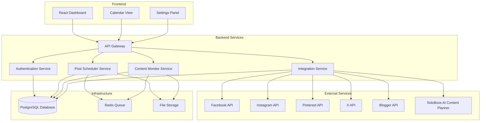

# Design Document

## Overview

The Social Media Automation Platform is a web-based application that provides centralized management for scheduling and publishing content across multiple social media platforms. The system integrates with Blogger for automatic post detection and SoloBoss AI Content Planner for seamless content workflow. The architecture follows a microservices pattern with separate services for each major function, ensuring scalability and maintainability.

## Architecture

### High-Level Architecture



### Technology Stack

- **Frontend**: React.js with TypeScript, Material-UI for components
- **Backend**: Node.js with Express.js and TypeScript
- **Database**: PostgreSQL for relational data, Redis for caching and queues
- **Authentication**: OAuth 2.0 for social media APIs, JWT for session management
- **File Storage**: AWS S3 or compatible service for media files
- **Deployment**: Docker containers with orchestration support

## Components and Interfaces

### 1. API Gateway Service

**Purpose**: Central entry point for all client requests, handles routing, authentication, and rate limiting.

**Key Interfaces**:
```typescript
interface APIGateway {
  authenticateRequest(token: string): Promise<User>;
  routeRequest(request: Request): Promise<Response>;
  enforceRateLimit(userId: string, endpoint: string): boolean;
}
```

### 2. Authentication Service

**Purpose**: Manages user authentication and social media API token storage.

**Key Interfaces**:
```typescript
interface AuthService {
  authenticateUser(credentials: LoginCredentials): Promise<AuthResult>;
  storeSocialToken(userId: string, platform: Platform, token: OAuthToken): Promise<void>;
  refreshToken(userId: string, platform: Platform): Promise<OAuthToken>;
  revokePlatformAccess(userId: string, platform: Platform): Promise<void>;
}

interface OAuthToken {
  accessToken: string;
  refreshToken?: string;
  expiresAt: Date;
  scope: string[];
}
```

### 3. Post Scheduler Service

**Purpose**: Handles post creation, scheduling, and execution across social media platforms.

**Key Interfaces**:
```typescript
interface SchedulerService {
  createPost(post: PostData): Promise<ScheduledPost>;
  schedulePost(postId: string, scheduledTime: Date): Promise<void>;
  executeScheduledPosts(): Promise<ExecutionResult[]>;
  updatePost(postId: string, updates: Partial<PostData>): Promise<ScheduledPost>;
  deletePost(postId: string): Promise<void>;
}

interface PostData {
  userId: string;
  platforms: Platform[];
  content: string;
  images?: string[];
  hashtags?: string[];
  scheduledTime?: Date;
  platformSpecificContent?: Record<Platform, PlatformContent>;
}

interface ScheduledPost extends PostData {
  id: string;
  status: PostStatus;
  createdAt: Date;
  updatedAt: Date;
}
```

### 4. Content Monitor Service

**Purpose**: Monitors Blogger for new posts and processes content from external sources.

**Key Interfaces**:
```typescript
interface MonitorService {
  monitorBloggerFeed(userId: string): Promise<void>;
  processBlogPost(blogPost: BlogPost): Promise<GeneratedSocialPosts>;
  processContentFromSoloBoss(content: SoloBossContent): Promise<ProcessedContent>;
}

interface BlogPost {
  id: string;
  title: string;
  content: string;
  url: string;
  publishedAt: Date;
  author: string;
}

interface GeneratedSocialPosts {
  posts: PostData[];
  requiresReview: boolean;
}
```

### 5. Integration Service

**Purpose**: Handles communication with external social media APIs and third-party services.

**Key Interfaces**:
```typescript
interface IntegrationService {
  publishToFacebook(post: PostData, token: OAuthToken): Promise<PublishResult>;
  publishToInstagram(post: PostData, token: OAuthToken): Promise<PublishResult>;
  publishToPinterest(post: PostData, token: OAuthToken): Promise<PublishResult>;
  publishToX(post: PostData, token: OAuthToken): Promise<PublishResult>;
  connectToSoloBoss(userId: string, apiKey: string): Promise<ConnectionResult>;
}

interface PublishResult {
  success: boolean;
  platformPostId?: string;
  error?: string;
  retryable: boolean;
}
```

## Data Models

### User Model
```typescript
interface User {
  id: string;
  email: string;
  name: string;
  createdAt: Date;
  updatedAt: Date;
  settings: UserSettings;
}

interface UserSettings {
  timezone: string;
  defaultHashtags: string[];
  autoApproveFromSoloBoss: boolean;
  bloggerIntegrationEnabled: boolean;
}
```

### Platform Connection Model
```typescript
interface PlatformConnection {
  id: string;
  userId: string;
  platform: Platform;
  platformUserId: string;
  platformUsername: string;
  accessToken: string; // encrypted
  refreshToken?: string; // encrypted
  tokenExpiresAt?: Date;
  isActive: boolean;
  createdAt: Date;
  updatedAt: Date;
}

enum Platform {
  FACEBOOK = 'facebook',
  INSTAGRAM = 'instagram',
  PINTEREST = 'pinterest',
  X = 'x'
}
```

### Post Model
```typescript
interface Post {
  id: string;
  userId: string;
  content: string;
  images: string[];
  hashtags: string[];
  platforms: Platform[];
  scheduledTime?: Date;
  status: PostStatus;
  source: PostSource;
  platformPosts: PlatformPost[];
  createdAt: Date;
  updatedAt: Date;
}

enum PostStatus {
  DRAFT = 'draft',
  SCHEDULED = 'scheduled',
  PUBLISHING = 'publishing',
  PUBLISHED = 'published',
  FAILED = 'failed'
}

enum PostSource {
  MANUAL = 'manual',
  BLOGGER = 'blogger',
  SOLOBOSS = 'soloboss'
}

interface PlatformPost {
  platform: Platform;
  platformPostId?: string;
  content: string;
  status: PostStatus;
  publishedAt?: Date;
  error?: string;
}
```

## Error Handling

### Retry Strategy
- **Exponential Backoff**: Failed posts retry with delays of 1min, 5min, 15min
- **Platform-Specific Handling**: Different retry logic for rate limits vs. authentication errors
- **Dead Letter Queue**: Posts that fail all retries move to manual review queue

### Error Categories
1. **Authentication Errors**: Token expired, insufficient permissions
2. **Rate Limit Errors**: API quota exceeded, temporary throttling
3. **Content Errors**: Invalid content format, policy violations
4. **Network Errors**: Temporary connectivity issues, timeouts
5. **Platform Errors**: Service unavailable, maintenance mode

### Error Response Format
```typescript
interface ErrorResponse {
  code: string;
  message: string;
  details?: Record<string, any>;
  retryable: boolean;
  retryAfter?: number;
}
```

## Testing Strategy

### Unit Testing
- **Service Layer**: Mock external APIs, test business logic
- **Data Layer**: Test database operations with test database
- **Utility Functions**: Test content formatting, validation logic

### Integration Testing
- **API Endpoints**: Test complete request/response cycles
- **External Services**: Use sandbox/test environments for social media APIs
- **Database Integration**: Test with containerized PostgreSQL instance

### End-to-End Testing
- **User Workflows**: Test complete user journeys from login to post publishing
- **Scheduled Posts**: Test time-based execution with accelerated timers
- **Error Scenarios**: Test failure handling and recovery mechanisms

### Performance Testing
- **Load Testing**: Simulate concurrent users and high post volumes
- **API Rate Limits**: Test behavior under platform rate limit constraints
- **Database Performance**: Test query performance with large datasets

### Security Testing
- **Token Security**: Verify encryption and secure storage of API tokens
- **Input Validation**: Test against injection attacks and malformed data
- **Authentication**: Test OAuth flows and session management
- **Authorization**: Verify users can only access their own data

### Monitoring and Observability
- **Application Metrics**: Response times, error rates, throughput
- **Business Metrics**: Posts published, success rates by platform
- **Infrastructure Metrics**: Database performance, queue depth
- **Alerting**: Failed posts, authentication errors, system downtime