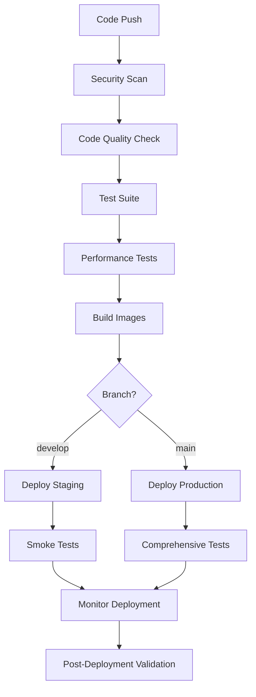

# DevOps Infrastructure Documentation

## Overview

This document describes the comprehensive DevOps infrastructure for the Social Media Automation Platform, including CI/CD pipelines, deployment strategies, monitoring, and operational procedures.

## Table of Contents

1. [CI/CD Pipeline](#cicd-pipeline)
2. [Blue-Green Deployment](#blue-green-deployment)
3. [Monitoring and Alerting](#monitoring-and-alerting)
4. [Backup and Recovery](#backup-and-recovery)
5. [Security and Compliance](#security-and-compliance)
6. [Operational Procedures](#operational-procedures)
7. [Troubleshooting](#troubleshooting)

## CI/CD Pipeline

### Pipeline Overview

The enhanced CI/CD pipeline provides comprehensive testing, security scanning, and deployment automation:



### Pipeline Stages

#### 1. Security Scanning
- **npm audit**: Vulnerability scanning for dependencies
- **Snyk**: Advanced security analysis
- **CodeQL**: Static code analysis
- **Semgrep**: Security pattern detection

#### 2. Code Quality
- **ESLint**: JavaScript/TypeScript linting
- **Prettier**: Code formatting validation
- **SonarCloud**: Code quality and maintainability analysis

#### 3. Testing
- **Unit Tests**: Component and function-level testing
- **Integration Tests**: API and service integration testing
- **End-to-End Tests**: Complete user workflow testing
- **Performance Tests**: Load and stress testing

#### 4. Container Building
- **Multi-platform builds**: AMD64 and ARM64 support
- **Image signing**: Cosign for container image verification
- **Layer caching**: Optimized build times
- **Security scanning**: Container vulnerability assessment

### Configuration Files

- **Main Pipeline**: `.github/workflows/enhanced-ci-cd.yml`
- **Legacy Pipeline**: `.github/workflows/ci.yml` (maintained for compatibility)

## Blue-Green Deployment

### Strategy Overview

Blue-green deployment ensures zero-downtime updates by maintaining two identical production environments:

- **Blue Environment**: Currently active production
- **Green Environment**: New version being deployed

### Deployment Process

1. **Deploy to Inactive Environment**: New version deployed to inactive color
2. **Health Checks**: Comprehensive testing of new deployment
3. **Traffic Switch**: Load balancer redirects traffic to new version
4. **Monitoring**: Continuous monitoring for issues
5. **Rollback**: Automatic rollback if problems detected
6. **Cleanup**: Scale down old environment after successful deployment

### Scripts

- **Deployment**: `scripts/blue-green-deploy.sh`
- **Rollback**: `scripts/rollback-deployment.sh`
- **Monitoring**: `scripts/monitor-deployment.sh`

### Usage Examples

```bash
# Deploy to staging
./scripts/blue-green-deploy.sh staging ghcr.io/repo/backend:v1.2.3 ghcr.io/repo/frontend:v1.2.3

# Deploy to production
./scripts/blue-green-deploy.sh production ghcr.io/repo/backend:v1.2.3 ghcr.io/repo/frontend:v1.2.3

# Rollback production
./scripts/rollback-deployment.sh production

# Monitor deployment for 10 minutes
./scripts/monitor-deployment.sh production 600
```

## Monitoring and Alerting

### Monitoring Stack

#### Google Cloud Monitoring
- **Uptime Checks**: Backend and frontend availability monitoring
- **Performance Metrics**: Response time, throughput, error rates
- **Resource Monitoring**: CPU, memory, disk usage
- **Custom Dashboards**: Real-time operational visibility

#### Alert Policies
- **Service Downtime**: Immediate alerts for service unavailability
- **High Error Rate**: Alerts when error rate exceeds 5%
- **Resource Exhaustion**: CPU > 80%, Memory > 90%
- **Database Issues**: Connection failures, high query times

#### Notification Channels
- **Email**: Critical alerts to operations team
- **Slack**: Real-time notifications to development team
- **PagerDuty**: Escalation for critical production issues

### Metrics Collection

#### Application Metrics
- Request count and response times
- Error rates by endpoint
- Database query performance
- Cache hit/miss rates
- Queue processing times

#### Infrastructure Metrics
- Pod resource usage
- Node health and capacity
- Network traffic and latency
- Storage utilization

#### Business Metrics
- User registration and authentication rates
- Post creation and publishing success rates
- Platform connection health
- API usage patterns

### Dashboards

#### Operational Dashboard
- Service health overview
- Key performance indicators
- Error rate trends
- Resource utilization

#### Performance Dashboard
- Response time percentiles
- Throughput metrics
- Database performance
- Cache effectiveness

#### Business Dashboard
- User activity metrics
- Feature usage statistics
- Platform integration health
- Revenue and cost tracking

## Backup and Recovery

### Backup Strategy

#### Database Backups
- **Automated Daily Backups**: Cloud SQL automated backups
- **Point-in-Time Recovery**: 7-day recovery window
- **Cross-Region Replication**: Disaster recovery backups
- **Backup Verification**: Automated integrity checks

#### Application Data Backups
- **Configuration Backups**: Kubernetes manifests and secrets
- **User Data Exports**: Compliance with data protection regulations
- **Code Repository Backups**: Multiple Git hosting providers

#### Infrastructure Backups
- **Terraform State**: Remote state with versioning
- **Container Images**: Multi-registry storage
- **Monitoring Configuration**: Exportable dashboard and alert definitions

### Recovery Procedures

#### Database Recovery
```bash
# Point-in-time recovery
gcloud sql backups restore BACKUP_ID --restore-instance=TARGET_INSTANCE

# Cross-region recovery
gsutil cp gs://backup-bucket/database-backup.sql .
psql -h HOST -U USER -d DATABASE < database-backup.sql
```

#### Application Recovery
```bash
# Rollback to previous version
./scripts/rollback-deployment.sh production

# Restore from backup
kubectl apply -f backup/kubernetes-manifests/
```

#### Disaster Recovery
1. **Assess Impact**: Determine scope of disaster
2. **Activate DR Site**: Switch to disaster recovery region
3. **Restore Data**: Recover from cross-region backups
4. **Update DNS**: Redirect traffic to DR environment
5. **Validate Services**: Comprehensive testing of restored services
6. **Communicate Status**: Update stakeholders and users

## Security and Compliance

### Security Measures

#### Network Security
- **VPC Isolation**: Private network for all resources
- **Firewall Rules**: Restrictive ingress/egress policies
- **Load Balancer Security**: DDoS protection and rate limiting
- **SSL/TLS**: End-to-end encryption for all communications

#### Application Security
- **Authentication**: JWT with refresh token rotation
- **Authorization**: Role-based access control
- **Input Validation**: Comprehensive sanitization and validation
- **Security Headers**: HSTS, CSP, X-Frame-Options

#### Data Security
- **Encryption at Rest**: Database and storage encryption
- **Encryption in Transit**: TLS 1.3 for all communications
- **Key Management**: Google Cloud KMS for key rotation
- **Access Logging**: Comprehensive audit trails

#### Container Security
- **Image Scanning**: Vulnerability assessment for all images
- **Image Signing**: Cosign verification for image integrity
- **Runtime Security**: Pod security policies and network policies
- **Secrets Management**: Kubernetes secrets with encryption

### Compliance

#### Data Protection
- **GDPR Compliance**: User data export and deletion capabilities
- **Data Retention**: Automated cleanup of expired data
- **Privacy Controls**: User consent management
- **Data Minimization**: Collection of only necessary data

#### Security Standards
- **SOC 2 Type II**: Security and availability controls
- **ISO 27001**: Information security management
- **OWASP Top 10**: Protection against common vulnerabilities
- **CIS Benchmarks**: Secure configuration standards

## Operational Procedures

### Deployment Procedures

#### Staging Deployment
1. **Automated Trigger**: Push to `develop` branch
2. **Pipeline Execution**: Full CI/CD pipeline
3. **Smoke Testing**: Basic functionality verification
4. **Stakeholder Notification**: Deployment completion alert

#### Production Deployment
1. **Manual Approval**: Required for production deployments
2. **Pre-deployment Checks**: System health verification
3. **Blue-Green Deployment**: Zero-downtime deployment
4. **Post-deployment Monitoring**: Extended health monitoring
5. **Rollback Readiness**: Immediate rollback capability

### Incident Response

#### Severity Levels
- **P0 (Critical)**: Complete service outage
- **P1 (High)**: Major functionality impaired
- **P2 (Medium)**: Minor functionality affected
- **P3 (Low)**: Cosmetic or documentation issues

#### Response Procedures
1. **Detection**: Automated alerts or user reports
2. **Assessment**: Determine severity and impact
3. **Response Team**: Assemble appropriate team members
4. **Mitigation**: Implement immediate fixes or workarounds
5. **Communication**: Update stakeholders and users
6. **Resolution**: Permanent fix implementation
7. **Post-Mortem**: Root cause analysis and improvements

### Maintenance Procedures

#### Regular Maintenance
- **Weekly**: Security updates and patches
- **Monthly**: Performance optimization review
- **Quarterly**: Disaster recovery testing
- **Annually**: Security audit and compliance review

#### Scheduled Maintenance
- **Notification**: 48-hour advance notice
- **Maintenance Window**: Low-traffic periods
- **Rollback Plan**: Immediate rollback capability
- **Status Updates**: Real-time communication during maintenance

## Troubleshooting

### Common Issues

#### Deployment Failures
```bash
# Check deployment status
kubectl get deployments -n sma-production

# View deployment logs
kubectl logs -f deployment/sma-backend -n sma-production

# Rollback if necessary
./scripts/rollback-deployment.sh production
```

#### Performance Issues
```bash
# Check resource usage
kubectl top pods -n sma-production

# Analyze performance metrics
./scripts/check-performance-regression.js

# Scale resources if needed
kubectl scale deployment sma-backend --replicas=5 -n sma-production
```

#### Database Issues
```bash
# Check database connectivity
kubectl exec -it sma-backend-pod -- pg_isready -h database-host

# Monitor database performance
gcloud sql operations list --instance=sma-database

# Create manual backup
gcloud sql backups create --instance=sma-database
```

### Monitoring and Debugging

#### Log Analysis
```bash
# View application logs
kubectl logs -f -l app=sma-backend -n sma-production

# Search for errors
kubectl logs -l app=sma-backend -n sma-production | grep ERROR

# Export logs for analysis
kubectl logs -l app=sma-backend -n sma-production > application.log
```

#### Performance Analysis
```bash
# Run performance tests
npm run test:performance --workspace=packages/backend

# Check response times
curl -w "@curl-format.txt" -o /dev/null -s https://api.sma-platform.com/health

# Monitor resource usage
watch kubectl top pods -n sma-production
```

### Emergency Procedures

#### Complete Service Outage
1. **Immediate Response**: Activate incident response team
2. **Status Page**: Update service status page
3. **Investigation**: Identify root cause
4. **Mitigation**: Implement emergency fixes
5. **Communication**: Regular updates to stakeholders
6. **Recovery**: Restore full service functionality

#### Data Loss Prevention
1. **Stop Write Operations**: Prevent further data corruption
2. **Assess Damage**: Determine scope of data loss
3. **Restore from Backup**: Use most recent clean backup
4. **Validate Restoration**: Verify data integrity
5. **Resume Operations**: Carefully restart services

## Scripts Reference

### Deployment Scripts
- `scripts/blue-green-deploy.sh`: Blue-green deployment
- `scripts/rollback-deployment.sh`: Automated rollback
- `scripts/monitor-deployment.sh`: Deployment monitoring
- `scripts/smoke-tests.sh`: Post-deployment testing

### Maintenance Scripts
- `scripts/cleanup-images.sh`: Container image cleanup
- `scripts/cleanup-deployments.sh`: Kubernetes resource cleanup
- `scripts/update-deployment-metrics.sh`: Metrics collection
- `scripts/check-performance-regression.js`: Performance analysis

### Infrastructure Scripts
- `terraform/main.tf`: Main infrastructure configuration
- `terraform/modules/monitoring/`: Monitoring infrastructure
- `terraform/modules/backup/`: Backup infrastructure

## Best Practices

### Development
- **Feature Branches**: Use feature branches for all changes
- **Code Reviews**: Mandatory peer review for all changes
- **Testing**: Comprehensive test coverage before deployment
- **Documentation**: Keep documentation updated with changes

### Operations
- **Monitoring**: Proactive monitoring and alerting
- **Automation**: Automate repetitive operational tasks
- **Documentation**: Maintain runbooks for common procedures
- **Training**: Regular training on operational procedures

### Security
- **Principle of Least Privilege**: Minimal required permissions
- **Regular Updates**: Keep all systems and dependencies updated
- **Security Scanning**: Regular vulnerability assessments
- **Incident Response**: Prepared response procedures

## Contact Information

### On-Call Rotation
- **Primary**: DevOps Engineer (24/7)
- **Secondary**: Senior Developer (business hours)
- **Escalation**: Engineering Manager

### Communication Channels
- **Slack**: #devops-alerts, #incident-response
- **Email**: devops@sma-platform.com
- **Phone**: Emergency hotline for P0 incidents

### External Services
- **Cloud Provider**: Google Cloud Platform
- **Monitoring**: Google Cloud Monitoring
- **Container Registry**: GitHub Container Registry
- **DNS**: Cloudflare